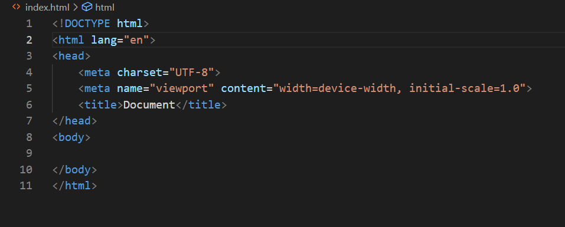

# Kodluyoruz Ilk Repo
Bu repo [Kodluyoruz](https://kodluyoruz.org/) Java Eğitimi kapsamında açtığım ilk repo.Içerisnde bir adet read me dosyası bir adet de index.html dosyası barındırıyor.

## Installation
Öncelikler projeyi clonelayın.(Buraya sizin reponuzdan aldığınız link gelecek)
```git clone https://github.com/Huseyin23s/kodluyoruzilkrepo.git```

## Usage
Projeyi cloneladıktan sonra visual studio code programında açınız.

Linux için:

```kodluyoruzilkrepo code .```

## Contributing
Pull requestler kabul edilir.Büyük değişiklikler için,lütfen önce neyi değiştirmek istediğinizi tartışmak için bir konu açınız.

## License

[MIT](https://docs.github.com/en/repositories/managing-your-repositorys-settings-and-features/customizing-your-repository/licensing-a-repository)



  
   


